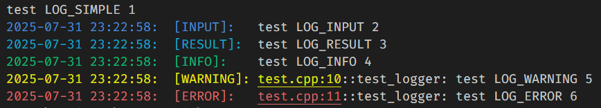

# Logger

## ✨ Example Usage

```cpp
void test_logger() {
    LOG_SIMPLE("test LOG_SIMPLE ", 1);
    LOG_INPUT("test LOG_INPUT ", 2);
    LOG_RESULT("test LOG_RESULT ", 3);
    LOG_INFO("test LOG_INFO ", 4);
    LOG_WARNING("test LOG_WARNING ", 5);
    LOG_ERROR("test LOG_ERROR ", 6);
}
```

This code will produce the following output:



---

## 📄 Simple Output

```cpp
Logger::instance().log(Logger::INFO, "test ", "output");
```

However, it is usually more convenient to use the predefined macros:

```
LOG_SIMPLE, LOG_INPUT, LOG_RESULT,
LOG_INFO, LOG_WARNING, LOG_ERROR
```

---

## 📁 File Output

To redirect log output of specific levels to a file:

```cpp
std::ofstream file("log.txt");
Logger::instance().set_output(Logger::WARNING, file);
Logger::instance().set_output(Logger::ERROR, file);
```

After this, all `WARNING` and `ERROR` messages will be written to `log.txt`.

---

## ⚙️ Output Optimization

To speed up terminal output, call this at the beginning of the program:

```cpp
Logger::instance().init_stdio();
```
